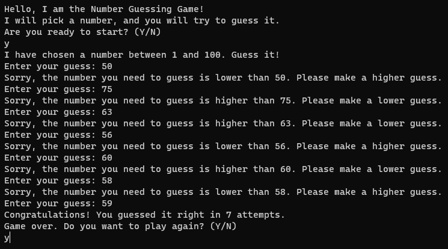

# Number Guessing Game

Welcome to the Number Guessing Game, a simple text-based guessing game built in C#.

## Introduction

This is a classic number guessing game where the computer randomly selects a number, and the player's goal is to guess the correct number within the given range.

## How to Play

1. The game will randomly choose a number between 1 and 100.
2. You will be asked to guess the chosen number.
3. Enter your guess.
4. The game will provide feedback based on your guess:
   - If your guess is too low, you will be instructed to make a higher guess.
   - If your guess is too high, you will be instructed to make a lower guess.
   - If your guess is correct, you win the game.
5. The game keeps track of the number of attempts it takes you to guess the correct number.
6. You can choose to play the game again or exit at the end.

## Getting Started

To play the game, follow these steps:

1. Clone this repository or download the code.
2. Build and run the program using C#.

## Screenshots

## Contributors

- [@M.Furkan Ayhan](https://github.com/mfurkanayhan)

Feel free to contribute to this project by adding more features or improving existing functionalities.

## License

This project is licensed under the MIT License. See the [LICENSE](LICENSE) file for details.

Enjoy the game!