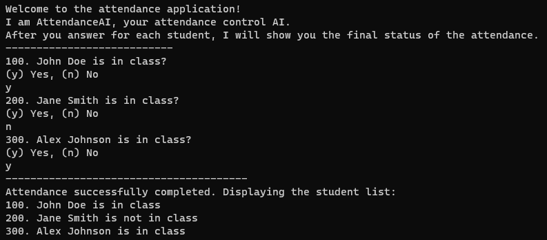

# Student Attendance Console Application

## Overview

This console application is designed to manage student attendance. It allows users to interactively mark students as present or absent and provides a final summary of the attendance status.

## Features

- User-friendly console interface.
- Dynamic addition of students to the attendance list.
- Interactive prompts for marking students' attendance.
- Clear display of the final attendance status.

## How to Use

1. **Run the Application:**
   - Execute the application in a console environment.

2. **Interactive Attendance Marking:**
   - Follow the on-screen prompts to mark each student's attendance.

3. **View Final Status:**
   - After marking attendance for all students, the application will display the final status.

## Student Class

The `Student` class represents an individual student and contains the following attributes:

- **No:** Unique identifier for the student.
- **Name:** Full name of the student.
- **IsInClass:** Boolean flag indicating whether the student is present.

## Usage of Ternary Operator

The code utilizes the ternary operator for concise status display. For example:

```csharp
Console.WriteLine($"{st.No}. {st.Name} is {(st.IsInClass == true ? "in class" : "not in class")}");
```
## Screenshots

- Here's an example of the application output:



## Dependencies

- This project uses C# and .NET for development. Ensure you have the necessary runtime installed.

## Contributors

- [@M.Furkan Ayhan](https://github.com/mfurkanayhan)

Feel free to contribute to this project by adding more features or improving existing functionalities.

## License

This project is licensed under the [MIT License](LICENSE).