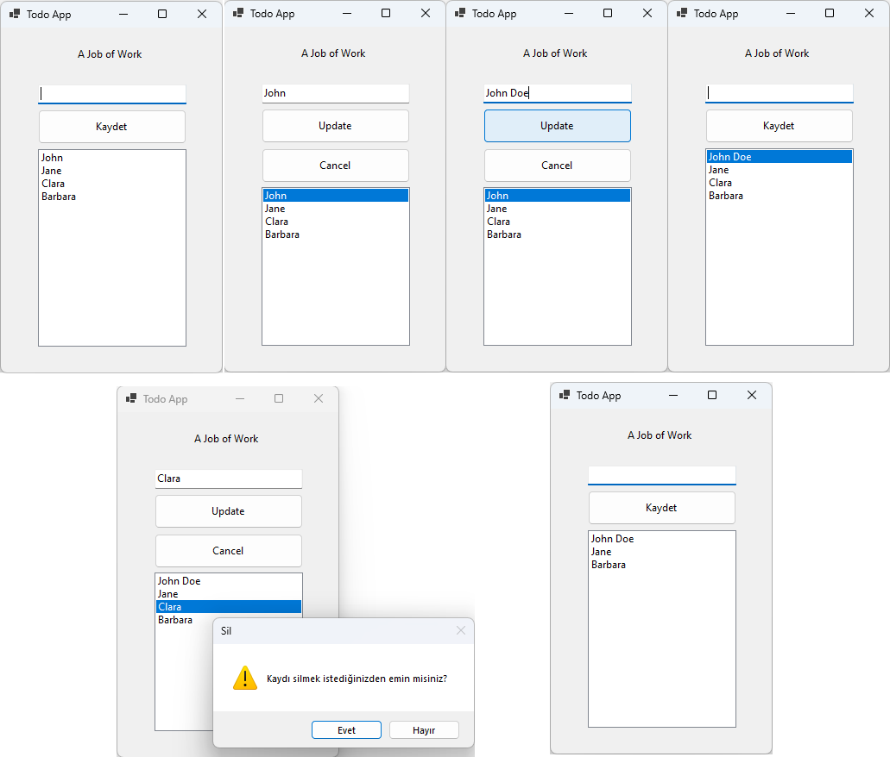

# MyFirstApp

MyFirstApp is a C# Windows Forms application that provides a simple to-do list functionality.

## Table of Contents

1. [About the Project](#about-the-project)
2. [Features](#features)
3. [Getting Started](#getting-started)
4. [Installation](#installation)
5. [Usage](#usage)
6. [Contributing](#contributing)
7. [License](#license)

## About the Project

This project includes a simple to-do list application where users can add new tasks, edit existing ones, and delete them.

## Features

- Ability to add a new task
- Ability to edit or delete an existing task
- View the list of tasks

## Screenshots

- Here's an example of the application output:



## Getting Started

You can access the MyFirstApp project by navigating to the "02.DesktopApps" folder within the "senior-dotnet-developer-roadmap" repository.

1. Clone the project to your computer or download the ZIP file using the following commands:

```bash
git clone https://github.com/mfurkanayhan/senior-dotnet-developer-roadmap.git
```

or

[Download ZIP](https://github.com/mfurkanayhan/senior-dotnet-developer-roadmap/archive/main.zip)

2. Open the project in Visual Studio or a similar C# development environment.

3. Explore the Form1.cs and Form1.Designer.cs files to understand the code.

## Installation

The project can be opened in Visual Studio or a similar C# development environment. After opening the project, you can understand the code by reviewing the Form1.cs and Form1.Designer.cs files.

## Usage

1. Launch the application.
2. To add a new task, type the task in the text box and click the "Save" button.
3. To delete an existing task, double-click on the task in the list.
4. To update a task, click on the task in the list, make your updates, and then click the "Update" button.

## Contributing

If you would like to contribute to this project, please open an issue to discuss the changes. Afterward, you can create a pull request.

## License

This project is licensed under the MIT License - see the [LICENSE](LICENSE) file for more information.