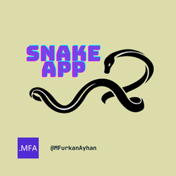
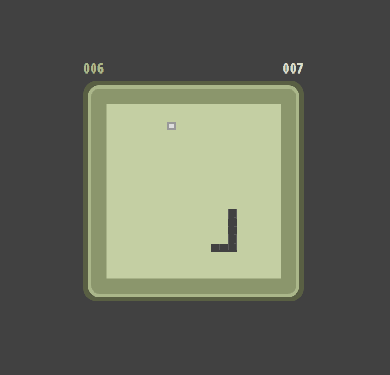

# Snake App

## Description
The Snake App is a classic Snake game developed using HTML, CSS, and JavaScript. The game features a nostalgic design with smooth animations and a scoring system to keep track of your high scores.

## Features

- **Simple Controls:** Use the arrow keys to control the snake's direction.
- **Scoring System:** Keep track of your current score and your highest score.
- **Increasing Difficulty:** The game speeds up as the snake consumes food, making it progressively more challenging.
- **Responsive Design:** The game board and elements adjust to fit different screen sizes.

## How to Play

1. Open `index.html` in any modern web browser.
2. Press the spacebar to start the game.
3. Use the arrow keys (Up, Down, Left, Right) to control the snake.
4. Try to eat as many food items as possible without colliding with the walls or the snake's own body.
5. The game will end if the snake hits the wall or itself. Press spacebar to restart.

## Installation

No installation necessary. Simply download the files and open `index.html` in your browser.

## Screenshot

## Acknowledgments

- Inspired by the traditional Snake game
- Special thanks to everyone who has contributed to testing and improving the app.

Enjoy the game and try to beat your high score!
