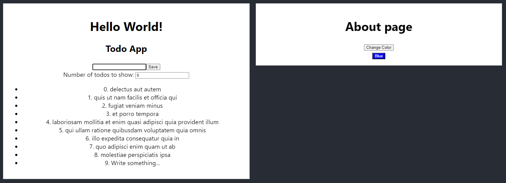

# Basic React SPA Example

This project demonstrates a basic Single Page Application (SPA) using React. It includes two main components: **\`TodoComponent**\` and **\`AboutComponent**\`, which are displayed side by side on the main page.

## Components

### AboutComponent

The **\`AboutComponent**\` allows users to change the background color of a button by clicking a "Change Color" button. The button toggles between red and blue colors.

### TodoComponent

The **\`TodoComponent**\` allows users to add todos to a list and fetches todos from an external API (https://jsonplaceholder.typicode.com/todos) when the component is first rendered. The component also allows users to limit the number of todos displayed.

## Main App Component

The `App` component renders the **\`TodoComponent**\` and **\`AboutComponent**\` inside a header section.

### Screenshot

This screenshot shows the **\`TodoComponent**\` on the left and the **\`AboutComponent**\` on the right, displayed side by side as intended.

## Conclusion
This project serves as a simple example of a React SPA with basic components and styling. Feel free to expand and modify it as needed for your own projects.