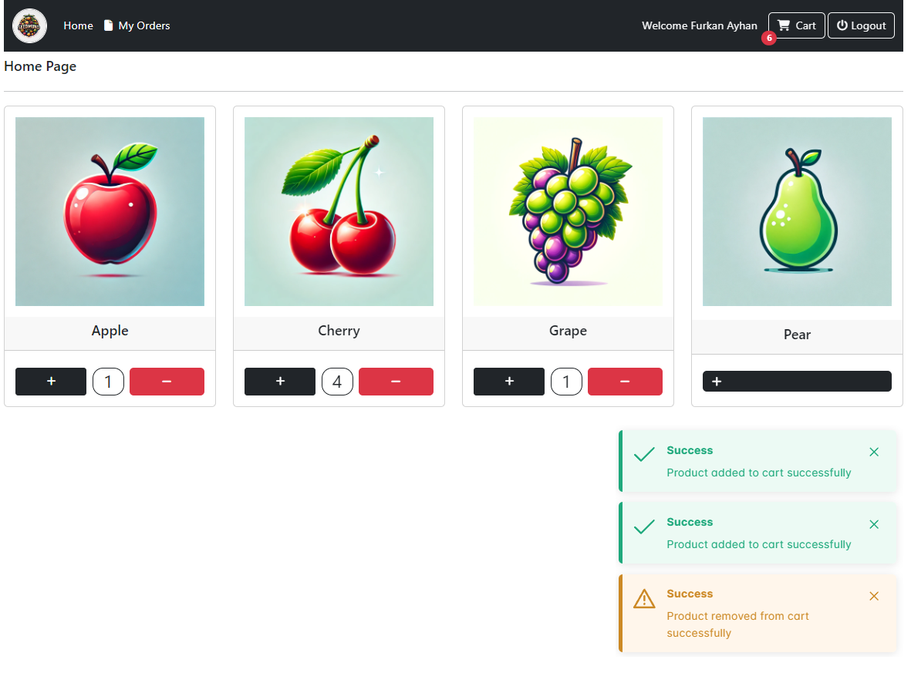

# E-Commerce Application

## Overview

This project is a simple e-commerce application developed using Angular for the frontend and ASP.NET Core for the backend. The application allows users to view products, add them to their cart, and proceed to checkout. Users need to register and log in to make purchases.

## Features

- User registration and authentication
- Product listing
- Add products to the cart
- View and manage the cart
- Checkout process
- Order management
- JWT-based authentication

## Screenshots

### Landing Page


### Home Page


### Login Page


### Registration Page


### Cart Page


### Order Detail


### Order History


### Swagger UI


## Technologies Used

- **Frontend**: Angular, Bootstrap
- **Backend**: ASP.NET Core, Entity Framework Core
- **Database**: SQL Server
- **Authentication**: JWT (JSON Web Tokens)

## Setup Instructions

### Prerequisites

- Node.js and npm (Node Package Manager) installed
- .NET Core SDK installed
- SQL Server installed

### Cloning the Repository

1. Clone the repository:
    ```bash
    git clone https://github.com/mfurkanayhan/senior-dotnet-developer-roadmap.git
    ```

2. Navigate to the project directory:
    ```bash
    cd 07.Angular/eCommerce
    ```

### Backend Setup

1. Navigate to the backend project directory:
    ```bash
    cd eCommerceServer
    ```

2. Restore the dependencies:
    ```bash
    dotnet restore
    ```

3. Update the database:
    ```bash
    dotnet ef database update
    ```

4. Run the application:
    ```bash
    dotnet run
    ```

The backend server will start on `http://localhost:5222` for HTTP and `https://localhost:7250` for HTTPS.

### Frontend Setup

1. Navigate to the frontend project directory:
    ```bash
    cd ../eCommerceClient
    ```

2. Install the dependencies:
    ```bash
    npm install
    ```

3. Run the application:
    ```bash
    ng serve
    ```

The frontend application will start on `http://localhost:4200`.

## API Endpoints

### Authentication

- **POST** `/api/Auth/Register`: Register a new user
- **POST** `/api/Auth/Login`: Login a user and get a JWT token

### Home

- **GET** `/api/Home/GetProducts`: Get a list of all products

### Orders

- **GET** `/api/Orders/GetAll`: Get all orders for the logged-in user

### Products

- **GET** `/api/Products/GetAll`: Get a list of all products

### Shopping Cart

- **GET** `/api/ShoppingCarts/GetAll`: Get the user's shopping cart
- **GET** `/api/ShoppingCarts/Increment`: Increment the quantity of a product in the cart
- **GET** `/api/ShoppingCarts/Decrement`: Decrement the quantity of a product in the cart
- **GET** `/api/ShoppingCarts/RemoveById`: Remove a product from the cart by ID
- **GET** `/api/ShoppingCarts/Pay`: Proceed to payment

## Contact

For any questions or issues, please contact [M.Furkan Ayhan] at [mfurkana067@gmail.com].
