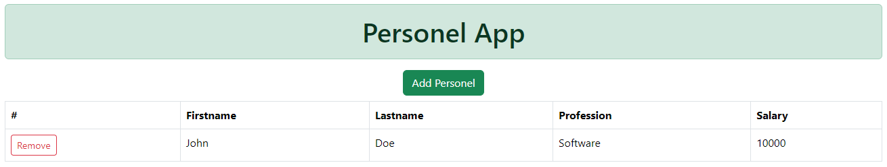
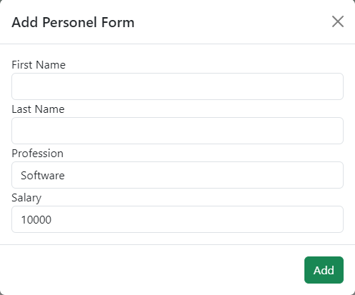

# MyApiApp

This project was generated with [Angular CLI](https://github.com/angular/angular-cli) version 17.0.6.

## Project Overview

Personel App is a personnel management application developed using Angular. This project provides basic functionality to display, add, and manage personnel information using JSON Server.

## Features

- Display personnel information in a table format
- Modal form to add new personnel
- Manage data with JSON Server

## Development server

Run `ng serve` for a dev server. Navigate to `http://localhost:4200/`. The application will automatically reload if you change any of the source files.

## Code scaffolding

Run `ng generate component component-name` to generate a new component. You can also use `ng generate directive|pipe|service|class|guard|interface|enum|module`.

## Build

Run `ng build` to build the project. The build artifacts will be stored in the `dist/` directory.

## Running JSON Server

To manage the personnel data, JSON Server is used. To start the JSON Server, follow these steps:

1. Install JSON Server if you haven't already:

    ```bash
    npm install -g json-server
    ```

2. Navigate to the project directory and start the JSON Server:

    ```bash
    json-server --watch src/assets/db.json
    ```

3. JSON Server will run on `http://localhost:3000` by default.

## Usage

On the main page, you will see the current personnel information displayed in a table. To add a new personnel, click the `Add Personel` button. Fill out the required fields in the modal form and click `Add`.

## Screenshots

### Main Page


---

### Add Personnel Form


For a better understanding of the project, refer to the project files.