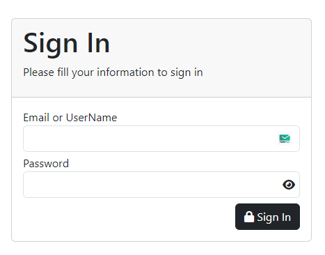
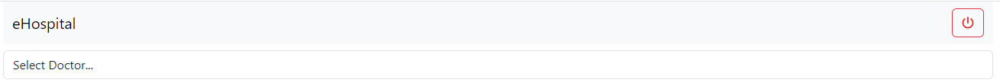
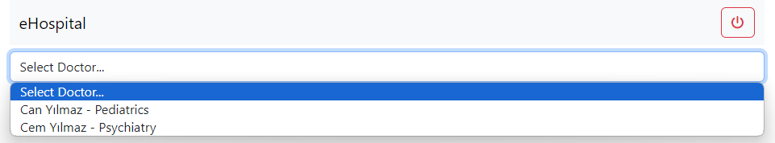
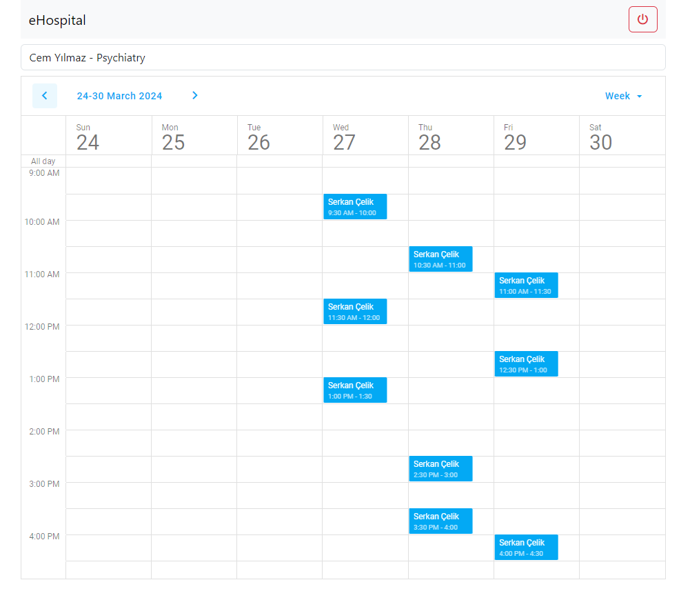
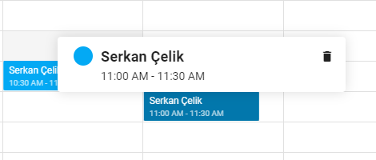
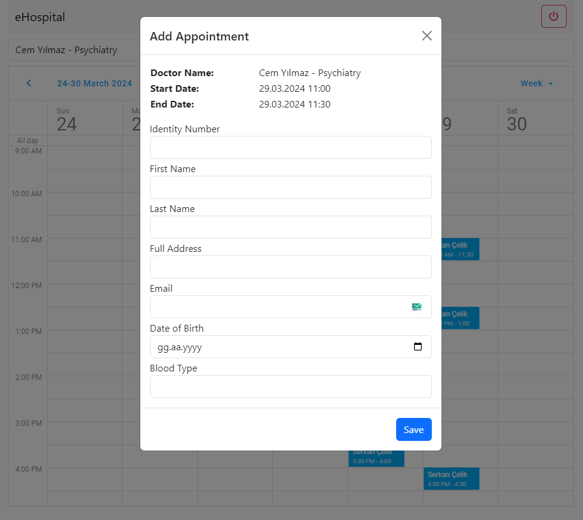

# eHospital

## Overview
eHospital offers a comprehensive patient management and appointment system for hospitals. This system enables both doctors and patients to manage their appointments effectively. Thanks to the user-friendly interface developed with Angular, doctors and hospital administrators can easily perform all operations.

## Features

- **User Login:** The system provides secure login capabilities for users with different levels of authority. Login for user types such as admin and doctor is actively prepared. Patient login and other user types are not yet completed, and their development is expected to be completed by those who download the project.
- **Doctor Selection and Viewing:** Users can choose from existing doctors and view their weekly appointment schedules.
- **Appointment Management:** Doctors can view and manage the appointments set for them. Patients can also make appointments with suitable doctors.
- **Adding Appointments:** Both doctors and patients can easily add new appointments through the system.

## Technologies

- **Frontend:** Angular
- **Backend:** .NET Core Web API
- **Database:** PostgreSQL, configured as a container running on Docker.
- **API Testing:** API endpoints are tested using Swagger.
- **Database Management:** Database management and queries are handled through DBeaver.

## Installation

Follow these steps to install the project in your local environment:

1. Clone the repository.
2. Run `npm install` and `dotnet restore` to install necessary dependencies.
3. Start the PostgreSQL container on Docker.
4. Launch the Angular application with `ng serve`.
5. Run the .NET Core API with `dotnet run`.

## Usage

After logging into the system, you will be directed according to your user type. If you log in as a doctor, you can view and manage your appointments. If you log in as an admin, you have the authority to view and manage all doctors' appointments. As mentioned earlier, I expect you to develop the parts of the project that are not yet completed and complete the system.

## Contribute

Further development of more user types is required in the project. Developments for patient login and other user types are awaited. You can contribute by forking the project and developing these parts.

## Screenshots

### Login Page

---

### Landing Page

---

### Select Doctor

---

### Home Page

---

### Appointment

---

### Add Appointment

---
 

For detailed information and testing capabilities for each endpoint, run the project and use the Swagger UI interface.

For a better understanding of the project, refer to the project files.
